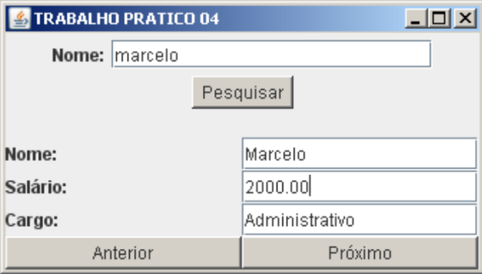

# Trabalho Prático 04

1. Elabore um programa em Java que apresente um frame semelhante ao que se segue:
  
   
2. Deverá criar um banco SQL chamado aulajava com as tabelas conforme o esquema abaixo:
   ### tbcargos * 
   ||Column Name|Data Type|Length|Allow Nulls|
   |:-:|-|-|-|:-:|
   |:key:|cd_cargo|smallint|2||
   ||ds_cargo|char|20|✔️|
   
   ### tbfuncs *
   ||Column Name|Data Type|Length|Aloww Nulls|
   |:-:|-|-|-|:-:|
   |:key:|cod_func|decimal|9||
   ||nome_func|char|30|✔️|
   ||sal_func|money|8|✔️|
   ||cod_cargo|smallint|2|✔️|
   
<br/>

   ```mermaid
   erDiagram
   tbfuncs }o--|| tbcargos : "cod_cargo"
   ```
<br/>

3. Acrescente alguns registros, respeitando as chaves e o relacionamento;
4. Estabeleça a conexão utilizando o JDBC;
5. Ao clicar no botão Pesquisar, deverá ser efetuado o select (utilize like) para “preencher” um recordset e PreparedStatement para fazer o SQL.
6. Os botões Próximo e Anterior devem permitir a navegação pelo recordset até os limites inicial e final.

<hr>

Clique [aqui](https://www.youtube.com/watch?v=VY_InevRAqo) para vizualizar a playlist com os programas funcionando.

### Desenvolvido por Beatriz Bastos Borges e Miguel Luizatto Alves
